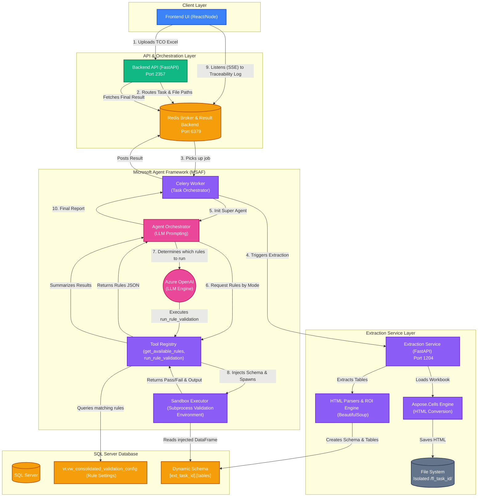

# AFG Estimate Analyser Architecture

This document describes the end-to-end architecture of the **AFG Estimate Analyser** system, detailing how components interact from UI upload down to the sandboxed agent validation.

## End-to-End Workflow Diagram

## Component Breakdown

1. **Frontend UI**: User interface to upload TCO Excel sheets and monitor real-time server-side events (SSE).
2. **Backend API**: The primary entry gateway that intercepts uploads, saves them temporarily, and delegates work to the asynchronous Celery queue.
3. **Redis Broker**: Acts as the message broker for Celery queues (`get_task_queue`), the state backend for results (`result_queue`), and the PubSub engine for real-time frontend logs (`tracebility_queue`).
4. **Extraction Service**: Dedicated process utilizing `Aspose.Cells` to map Excel sheets to precise HTML representations. It enforces strict isolation:
   - **File System**: `data/html_out/fl_<task_id>`
   - **Database**: `[ext_<task_id>]` Schema
5. **MSAF Celery Worker**: Handles asynchronous task loads. Initiates extraction, then spins up the Azure OpenAI Agent.
6. **Agent Orchestrator**: Uses Azure OpenAI (`gpt-4.1`). It leverages tools to actively fetch rules based on the detected layout (Waterfall/Agile) and loop through them sequentially.
7. **Sandbox Executor**: For extreme security and stability, the Agent does not run rule functions in its own thread. Instead, it spawns an isolated python `subprocess`. This sandbox contains SQL-intercept engines to ensure legacy raw SQL strings automatically bind to the correct isolated `[ext_<task_id>]` schema before utilizing the `pandas` analytic library. 
8. **SQL Server Database**: The central truth that holds configuration data (`vw_consolidated_validation_config`) and all dynamic extracted task grid states.
