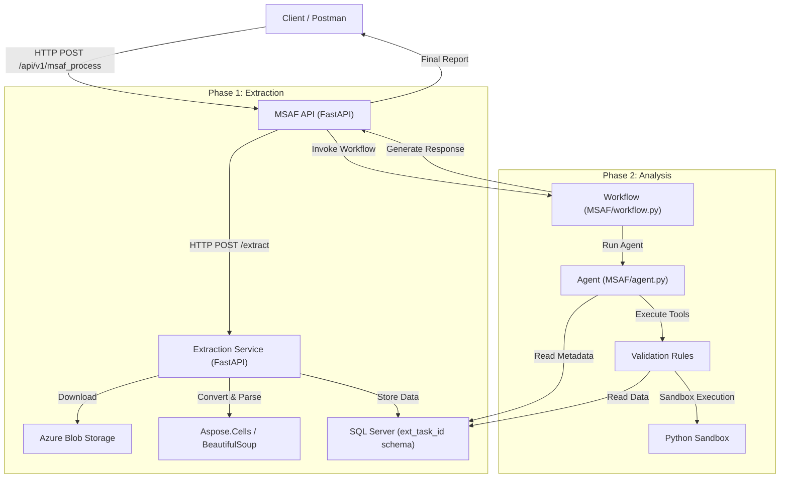

# System Architecture - AFG Estimate Analyser

This document provides a comprehensive overview of the AFG Estimate Analyser's technical architecture, component interactions, and the end-to-end data flow.

## 1. System Overview

The AFG Estimate Analyser is a specialized platform designed to automate the extraction, analysis, and validation of Excel-based Estimation Toolkits (TCOs). It transforms complex, unstructured Excel data into structured SQL tables and applies AI-driven agentic workflows to perform technical and financial validations.

## 2. Component Diagram



## 3. Detailed Data Flow (Step-by-Step)

### Step 1: Request Initiation
The workflow starts with a POST request to `/api/v1/msaf_process` containing a `task_id` and a `tco_file_path` (either a local path or an Azure Blob URL).

### Step 2: Extraction Triggering (`MSAF/workflow.py`)
The MSAF API initiates the **Direct Workflow**, which first calls the **Extraction Service** asynchronously.

### Step 3: High-Fidelity Extraction (`ExtractorTool/extraction_service.py`)
1.  **Job Sandboxing**: A temporary workspace is created at `data/temp/fl_<task_id>/`.
2.  **Blob Acquisition**: If the input is a Blob URL, the service downloads the Excel file to the temp workspace.
3.  **Excel-to-HTML Conversion**: `Aspose.Cells` converts Excel sheets into HTML files (preserving all coordinates like `A25_`).
4.  **Schema Preparation**: A unique SQL schema `ext_<task_id>` is created in SQL Server to ensure job isolation.
5.  **Parsing & Mapping**:
    - `BeautifulSoup` parses the HTML.
    - `header_subheader_detector.py` identifies nested structures.
    - `header_process.py` extracts tables and prepares them for database insertion.
6.  **Database Persistence**: Structured data is inserted into the `ext_<task_id>` schema. Metadata is stored for agent discovery.
7.  **Self-Cleanup**: The entire `data/temp/fl_<task_id>/` folder is deleted, leaving no trace on the filesystem.

### Step 4: Agent Orchestration (`MSAF/agent.py`)
Once extraction succeeds, the **Super Agent Orchestrator** takes over:
1.  **Context Discovery**: The agent queries the metadata tables in the `ext_<task_id>` schema to understand the available data.
2.  **Tool Selection**: Based on the project requirements, it selects appropriate validation rules.
3.  **Deep Analysis**:
    - The agent uses `sql_client.py` to retrieve specific data blocks.
    - It executes complex logic/calculations via `sandbox_executor.py` for safety.
4.  **Synthesis**: The agent compiles individual cross-checks into a holistic validation report.

### Step 5: Final Response
The MSAF API returns the structured analysis result to the user.

## 4. Directory Structure

```text
AFGEstimateAnalyser/
├── architecture.md           # This document
├── ExtractorTool/            # Phase 1: Data extraction service
│   ├── extraction_service.py # Core extraction microservice
│   ├── utils/                # HTML parsing and coordination
│   └── pg_utils/             # SQL Server insertion utilities
├── MSAF/                     # Phase 2: Agent framework
│   ├── main.py               # Standalone FastAPI entry point
│   ├── agent.py              # Super Agent (exported as 'agent')
│   ├── workflow.py           # Multi-step Workflow (exported as 'workflow')
│   ├── scripts/              # Standalone utility scripts (non-scanned)
│   └── sandbox_executor.py   # Secure tool execution environment
├── data/                     # Data storage
│   └── temp/                 # ephemeral job-specific sandboxes
├── sql_client.py             # Unified SQL Server client
├── .env                      # Global configuration
└── pl_deployment.ps1         # Deployment & Setup script
```

## 5. Technology Stack

| Layer | Technology |
| :--- | :--- |
| **API Framework** | FastAPI |
| **Excel Processing** | Aspose.Cells (High-fidelity HTML conversion) |
| **Parsing** | BeautifulSoup4 |
| **Database** | SQL Server (dynamic per-job schemas) |
| **Cloud Storage** | Azure Blob Storage |
| **AI Agent** | Microsoft Agent Framework (Agno) |
| **Infrastructure** | Python 3.x, PowerShell |

## 6. Key Architectural Principles

1.  **Zero-Footprint (Stateless)**: The system treats the local filesystem as a transient sandbox. All intermediate files are strictly cleaned up, ensuring suitability for scaled cloud environments.
2.  **Database Isolation**: Each extraction task operates within its own SQL schema (`ext_JOBID`), preventing data collisions between concurrent users.
3.  **Coordinate Precision**: By preserving Excel coordinates throughout the HTML conversion, the system allows for exact cell-level referencing during analysis.
4.  **Decoupled Services**: The separation of the Extraction Service and MSAF allows for independent scaling and maintenance of the "Data Engineering" and "AI Analysis" layers.
